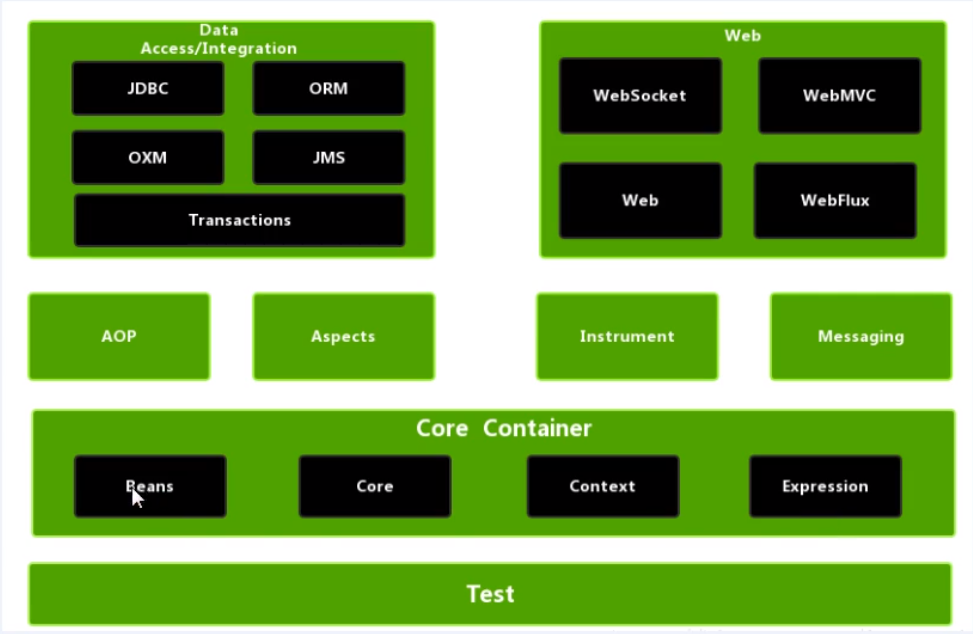
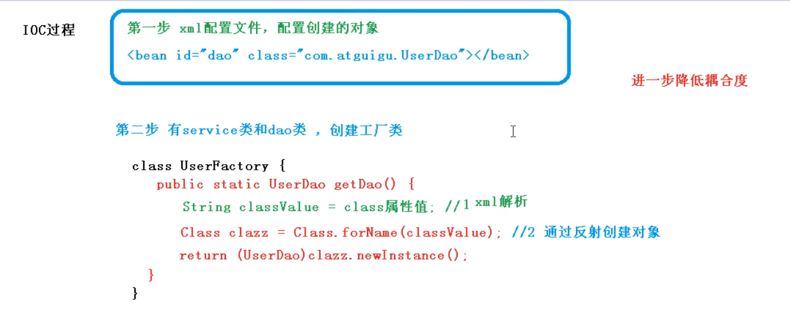

# Spring 5

# 一、框架概述

1. spring框架是一个轻量级的开源的JavaEE框架
2. 解决企业开发的复杂性

3. spring 核心部分 IOC 和 Aop
   - **ioc**：控制反转，即把创建对象的权利交给框架，也就是指将对象的创建、对象的存储、对象的管理交给了spring容器
   - **Aop**：面向切面，就是将那些与业务无关，却为业务模块所共同调用的逻辑或责任分开封装起来，便于减少系统的重复代码，降低模块间的耦合度，并有利于未来的可操作性和可维护性。

4. spring 特点

   > - **方便解耦，简化开发**
   > - **AOP[编程](https://baike.baidu.com/item/编程)的支持**
   > - **方便程序的测试**
   > - **方便集成各种优秀框架**
   > - **方便进行事务操作**
   > - **降低API开发难度**

Spring5 模块

# 二、IOC容器

1. ioc底层原理
2. ioc 接口（BeanFactory）
3. IOC操作Bean管理（基于xml）
4. IOC操作Bean管理（基于注解）、

## 2.1 IOC 概念和底层原理

>  **IOC 概念**

**ioc** ：控制反转，把对象创建和对象之间的调用过程，交给Spring 进行管理

**使用目的**：降低耦合度

>  **IOC 底层原理**

- xml解析、工厂模式、反射

**图解IOC 底层原理**

IOC 过程

- [ ] 

## 2.2 IOC 接口

- IOC 思想基于IOC 容器完成，IOC 容器底层就是对象工厂