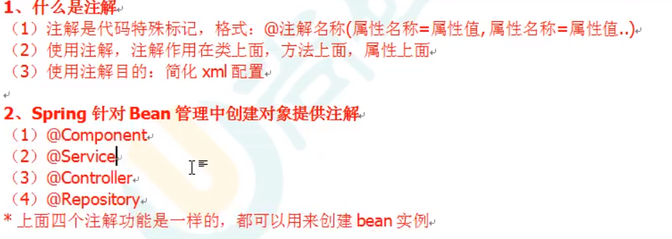

# Spring 5 :candy:

# 一、框架概述

1. spring框架是一个轻量级的开源的JavaEE框架
2. 解决企业开发的复杂性

3. spring 核心部分 IOC 和 Aop
   - **ioc**：控制反转，即把创建对象的权利交给框架，也就是指将对象的创建、对象的存储、对象的管理交给了spring容器
   - **Aop**：面向切面，就是将那些与业务无关，却为业务模块所共同调用的逻辑或责任分开封装起来，便于减少系统的重复代码，降低模块间的耦合度，并有利于未来的可操作性和可维护性。

4. spring 特点

   > - **方便解耦，简化开发**
   > - **AOP[编程](https://baike.baidu.com/item/编程)的支持**
   > - **方便程序的测试**
   > - **方便集成各种优秀框架**
   > - **方便进行事务操作**
   > - **降低API开发难度**

Spring5 模块


# 二、IOC容器

1. ioc底层原理
2. ioc 接口（BeanFactory）
3. IOC操作Bean管理（基于xml）
4. IOC操作Bean管理（基于注解）、

## 2.1 IOC 概念和底层原理

>  **IOC 概念**

**ioc** ：控制反转，把对象创建和对象之间的调用过程，交给Spring 进行管理

**使用目的**：降低耦合度


>  **IOC 底层原理**

- xml解析、工厂模式、反射


**图解IOC 底层原理**

IOC 过程


- [ ] 

## 2.2 IOC 接口

- IOC 思想基于IOC 容器完成，IOC 容器底层就是对象工厂

- spring 提供IOC 容器 实现的两种方式：

  - BeanFactory : IOC 容器的基本实现，Spring内部的使用接口 。不提供开发人员使用

  特点：加载配置文件是不会创建对象，在获取对象（使用时）才创建

  - ApplicationContext：BeanFactory 接口的子接口，提供更多更强大的功能

  特点：加载配置文件时就会把配置文件对象创建

- ApplicationContext接口有实现类


> 类路径下 与 c盘下


## 2.3 IOC操作Bean管理

**Bean管理**：

- Bean管理指两个操作

- spring 创建对象
- spring 注入属性

> Bean管理操作有两种方式
>
> 1. 基于xml配置文件方式实现
> 2. 基于注解方式实现


### 2.3.1 基于xml方式创建对象

```xml
<!--    配置user 类对象-->
<bean id="user" class="com.geek.User">
    <property name="name" value="wuhu"></property>
</bean>
```

- 使用Bean标签 实现对象创建

- Bean标签属性

  - id： 唯一标识
  - class ： 类全路径（包路径）

- 创建对象时，默认会执行无参数构造方法

  

### 2.3.2 基于xml方式注入属性

**DI**：依赖注入，注入属性

> - 第一种注入方式：使用set 方法注入
>   1. 创建类，定义属性和对应的set 方法
>
>   ~~~java
>   private String name;
>   
>   private String beanName;
>   
>   public void setName(String name) {
>       this.name = name;
>   }
>   public void setBeanName(String s) {
>       this.beanName = beanName;
>   }
>   ~~~
>
>   2. 配置文件，配置属性注入
>
>   ~~~xml
>       <bean id="user" class="com.geek.User">
>           <property name="name" value="name"></property>
>           <property name="beanName" value="beanName"></property>
>       </bean>
>   ~~~
>
> 
>
> - 第二种方式：使用有参构造注入
>   1. 创建类，定义属性，创建属性对应的有参构造方法
>
>   ~~~java
>   public class Order {
>   
>       private String oName;
>       private String address;
>   
>       public Order(String oName, String address) {
>           this.oName = oName;
>           this.address = address;
>       }
>   }
>   ~~~
>
>   2. 在spring 配置文件进行有参配置
>
>   ~~~xml
>   <!--    有参构造器注入属性-->
>       <bean id="order" class="com.geek.Order">
>   <!--        因为默认为无惨构造，所以加上有参构造-->
>           <constructor-arg name="oName" value="something"></constructor-arg>
>           <constructor-arg name="address" value="mars"></constructor-arg>
>       </bean>
>   ~~~
>


- #### xml注入其他类型属性

  - **字面量**

    > - null值
    >
    > ~~~xml
    >  <property name="author">
    >      <null/>
    > </property>
    > ~~~
    >
    > - 属性值包含特殊符号
    >
    > ~~~xml
    >         <!-- 属性值包含特殊符号
    >             1 把<>进行转义 &lt &gt
    >             2 内容写到CDATA
    >         -->
    >         <property name="address">
    >             <value><![CDATA[<<地区>>]]></value>
    >         </property>
    > ~~~
    >
    > 使用CDATA

  

  - **注入属性 -外部bean**

    1. 创建两个类service 类和dao 类

    2. 在service中调用dao里面的方法

       > dao层
       > ~~~java
       > public class UserDaoImpl implements UserDao{
       >     public void update() {
       >         System.out.println("dao update...");
       >     }
       > }
       > ~~~

       > service层
       > ~~~java
       > public class UserService {
       >     
       >     private UserDao userDao;
       >     
       >     public void setUserDao(UserDao userDao) {
       >         this.userDao = userDao;
       >     }
       >     
       >     public void add(){
       >         System.out.println("service add ....");
       >         userDao.update();//调用
       >     }
       >     
       > }
       > ~~~

       

    3. 在spring配置文件中进行配置

    ~~~xml
    <!--    1 service 和dao 对象的创建-->
        <bean id="userService" class="com.geek.service.UserService">
            <!--    注入 userDao 对象
                    name属性：类里面属性名称
                    ref属性：创建userDao对象bean标签id值
            -->
            <property name="userDao" ref="userDaoImpl"></property>
        </bean>
        <bean id="userDaoImpl" class="com.geek.dao.UserDaoImpl"></bean>
    ~~~
    
    
    
  - **注入属性 -内部bean和级联赋值**
  
    - 一对多的gaunx
    - 在实体类中表示一对多

~~~xml
<!--    员工配置文件-->
    <bean id="emp" class="com.geek.entity.Emp">
<!--        设置属性-->
        <property name="ename" value="Reines"></property>
        <property name="gender" value="girl"></property>
<!--    设置对象类型属性-->
        <property name="dept" ref="dept"></property>
        <property name="dept.dname" value="planet"></property>
    </bean>
    <bean id="dept" class="com.geek.entity.Dept">
        <property name="dname" value="magic"></property>
    </bean>
~~~


### 2.3.3 xml 注入集合属性

**1、注入数组类型属性**

**2、注入list类型属性**

**3、注入Map集合类型属性**

​	key value 以键值形式注入

**4、注入set类型**

 ~~~xml
    <bean id="collType" class="com.geek.entity.CollType">
<!--数组类型注入        -->
        <property name="courses">
            <array>
                <value>Reines</value>
                <value>magic</value>
            </array>
        </property>
<!--list类型注入        -->
        <property name="lists">
            <list>
                <value>Reines2</value>
                <value>magic2</value>
            </list>
        </property>
<!--map类型        -->
        <property name="maps">
            <map>
                <entry key="ccc" value="Reines3"></entry>
                <entry key="bbb" value="magic3"></entry>
            </map>
        </property>
<!--set类型        -->
        <property name="sets">
            <set>
                <value>Reines4</value>
                <value>magic4</value>
            </set>
        </property>
    </bean>
 ~~~

console

~~~console
[Reines, magic]
[Reines2, magic2]
{ccc=Reines3, bbb=magic3}
[Reines4, magic4]
~~~


**5、在list集合里设置对象**

~~~java
  //list 集合中放置对象
    private List<Course> courseList;
~~~

注入

~~~xml
<!--        增加的对象集合-->
        <property name="courseList">
            <list>
                <ref bean="course1"></ref>
                <ref bean="course2"></ref>
            </list>
        </property>
    </bean>

    <bean id="course1" class="com.geek.entity.Course">
        <property name="cname" value="spring"></property>
    </bean>
    <bean id="course2" class="com.geek.entity.Course">
        <property name="cname" value="mybatis"></property>
    </bean>
~~~

 **6、把集合注入部分提取出来**

-  xml配置文件中引入名称空间


    ~~~~XML
xmlns:util="http://www.springframework.org/schema/util"
    ~~~~

~~~xml
xsi:schemaLocation="http://www.springframework.org/schema/beans http://www.springframework.org/schema/beans/spring-beans.xsd
                    http://www.springframework.org/schema/util http://www.springframework.org/schema/util/spring-util.xsd">
~~~


- util标签完成list集合注入提取

    ~~~xml
    <!--提取list集合类型属性注入-->
    <util:list id="bookList">
        <value>Reines</value>
        <value>Gilbert</value>
        <value>magic</value>
    </util:list>
    <!--2 提取list 集合类型属性注入使用-->
    <bean id="book" class="com.geek.entity.Book">
        <property name="list" ref="bookList"></property>
    </bean>
    ~~~


​    

###     2.3.4 Factory Bean

- spring 两种bean ，普通bean 和工厂bean
- 普通bean： 配置文件中定义的bean 类型就是返回类型
- 工厂bean : 配置文件中定义的bean类型可以和返回类型不一致
  - 第一步，创建类，让这个类作为工厂bean，实现接口FactoryBean
  - 第二部，实现接口里的方法，在实现的方法中定义返回的bean类型

~~~java
public class MyBean implements FactoryBean<Course> {
    //返回bean的实例
    //定义FactoryBean<Course>后 返回的是Course 对象，而不是myBean对象
    public Course getObject() throws Exception {
        Course course = new Course();
        course.setCname("abcccc");
        return course;
    }
    //返回bean的类型
    public Class<?> getObjectType() {
        return null;
    }
    //bean 是否是一个单例
    public boolean isSingleton() {
        return false;
    }
}

~~~


### 2.3.5 bean的作用域

spring里 ，设置创建bean默认是单实例


输出的地址相同


> 设置bean 标签属性多实例
>
> - scope属性值
>   - singleton ；默认值，表示是单实例对象
>   - prototype： 表示多实例对象
>
> ~~~xml
> <!--prototype 设置为多实例-->
>     <bean id="myBean" class="com.geek.factorybean.MyBean" scope="prototype">
>     </bean>
> ~~~
>
> 再次执行对象地址不同
>
> 

`singleton 与 prototype`的区别：

1. 单实例与多实例
2. 设为scope默认值singleton时，或不设置时，加载spring配置文件时自动创建单实例对象 


### 2.3.6 Bean的声明周期

#### 1、生命周期

- 对象创建到对象销毁的过程 称为生命周期


#### 2、bean的生命周期

1. 通过构造器创建bean实例（无参数构造）
2. 为bean的属性设置值或对其他bean的引用（调用set方法）
3. 调用bean的初始化方法（需要进行配置初始化的方法）
4. bean可以使用了（对象获取到）
5. 当容器关闭时，调用bean的销毁的方法（需要配置销毁的方法）


#### 3、实际调用

~~~java
public class Orders {

    public Orders() {
        System.out.println("1. 执行无参构造器创建bean实例");
    }
    private String oname;

    public void setOname(String oname) {
        this.oname = oname;
        System.out.println("2. 调用set 方法设置属性值");
    }
    public void initMethod(){
        System.out.println("3. 执行初始化方法");
    }
    public void DestroyMethod(){
        System.out.println("5. 调用销毁方法");
    }
}

~~~

bean

~~~xml
    <bean name="orders" class="com.geek.entity.Orders" init-method="initMethod" destroy-method="DestroyMethod">
<!--        指定他的初始化方法 和销毁方法 需手动销毁-->
        <property name="oname" value="ccc"></property>
    </bean>
~~~

test

~~~java
//    声明周期测试
    @Test
    public void beanTest1(){
//        因为ApplicationContext没有close（）方法 所有需要调用子类ClassPathXmlApplicationContext的close
        ClassPathXmlApplicationContext context = new ClassPathXmlApplicationContext("beanTest1.xml");
        Orders orders = context.getBean("orders", Orders.class);
        System.out.println("4.获取创建的bean实例对象");
        System.out.println(orders);
        //        需要手动销毁
        context.close();

    }
~~~


#### 4、bean的后置处理器 

bean生命周期共7步

1. 通过构造器创建bean实例（无参数构造）
2. 为bean的属性设置值或对其他bean的引用（调用set方法）
3. 把bean实例传递bean后置处理器方法
4. 调用bean的初始化方法（需要进行配置初始化的方法）
5. 调用完初始化方法后，再把bean实例传递bean后置处理器方法
6. bean可以使用了（对象获取到）
7. 当容器关闭时，调用bean的销毁的方法（需要配置销毁的方法）


- 创建类，实现接口BeanPostProcessor，创建后置处理器

~~~java
public class MyBeanPost implements BeanPostProcessor{
    @Override
    public Object postProcessBeforeInitialization(Object o, String s) throws BeansException {
        return null;
    }

    @Override
    public Object postProcessAfterInitialization(Object o, String s) throws BeansException {
        return null;
    }
~~~


~~~xml
<!--    配置后置处理器-->
<!--    <bean name="MyBeanPost" class="com.geek.entity.MyBeanPost">-->
<!--    </bean>-->
~~~

### 2.3.7 xml自动装配

**根据指定的装配规则（属性名称或者属性类型 ），spring 自动将匹配的属性值进行注入**

实例：

~~~xml
<!--    xml自动装配
            bean标签 autowire，配置自动装配
            autowire属性值:
                byName:根据属性名称注入 ,注入bean的id值和类属性值名称一致
                byType:根据属性类型注入
-->
    <bean id="emp" class="com.geek.autowire.Emp" autowire="byType">
<!--        <property name="dept" ref="Dept"></property>-->
    </bean>
    <bean id="Dept" class="com.geek.autowire.Dept"> </bean>
~~~


### 2.3.8 外部属性文件

1.配置连接池 druid

~~~xml
    <!--  直接配置druid连接池  -->
    <bean id="dataSource" class="com.alibaba.druid.pool.DruidDataSource">
        <property name="driverClassName" value="com.mysql.jdbc.Driver"></property>
        <property name="url" value="jdbc:mysql://localhost:3306/db_test"></property>
        <property name="username" value="root"></property>
        <property name="password" value="123456"></property>
    </bean>
~~~

2.引入外部属性文件配置数据库连接池

properties文件引入

~~~xml
 xmlns:context="http://www.springframework.org/schema/context"
~~~

引入名称空间

~~~xml
 <!-- 引入properties外部文件   -->
    <context:property-placeholder location="classpath:jdbc.properties"/>

<!-- 引入 -->
 <property name="driverClassName" value="${prop.driverClass}"></property>
~~~

[properties]

~~~properties
prop.driverClass = com.mysql.jdbc.Driver
~~~


### 2.3.9 基于注解方式



组件扫描

~~~xml
<!--    开启组件扫描，多个包之间用，号隔开-->
    <context:component-scan base-package="com.geek.service,com.geek.dao"/>
<!--    扫描包的上层目录-->
    <context:component-scan base-package="com.geek"/>
~~~

创建类，在类上添加创建对象注解

~~~java
//在注解里面value属性值可以忽略不写
//默认值是类名称，首字母小写
@Component
public class UserService {

//    @Override
    public void add() {
        System.out.println("service add");
    }
}

~~~


开启组件扫描细节配置

```xml
<!--    组件扫描配置-->
<!--    1、
            use-default-filters="false" 不使用默认filters，自己配置filter
            include-filter 设置扫描哪些内容
-->
        <context:component-scan base-package="com.geek" use-default-filters="false">
            <context:include-filter type="annotation" expression="org.springframework.stereotype.Controller"/>
        </context:component-scan>

<!--    2、
            下面设置扫描包的所有内容
            <context:exclude-filter 设置哪些内容不进行扫描
-->
    <context:component-scan base-package="com.geek">
        <context:exclude-filter type="annotation" expression="org.springframework.stereotype.Controller"/>
    </context:component-scan>
```


基于注解的形式进行属性注入

- @Autowired 根据属性类型进行自动装配

- @Qualifier 根据属性名称进行注入

  - 要和@Autowired 一起使用

    @Autowired 

    @Qualifier(value = "userDaoImpl")

- @Resource  可以根据类型注入，也可以根据名称注入

- @Value 注入普通类型属性


> 完全注解开发

@Configuration

# 三、AOP概念

> AOP（面向切面编程）

在软件业，AOP为Aspect Oriented Programming的缩写，意为：[面向切面编程](https://baike.baidu.com/item/面向切面编程/6016335)，通过[预编译](https://baike.baidu.com/item/预编译/3191547)方式和运行期间动态代理实现程序功能的统一维护的一种技术。AOP是[OOP](https://baike.baidu.com/item/OOP)的延续，是软件开发中的一个热点，也是[Spring](https://baike.baidu.com/item/Spring)框架中的一个重要内容，是[函数式编程](https://baike.baidu.com/item/函数式编程/4035031)的一种衍生范型。利用AOP可以对业务逻辑的各个部分进行隔离，从而使得业务逻辑各部分之间的[耦合度](https://baike.baidu.com/item/耦合度/2603938)降低，提高程序的可重用性，同时提高了开发的效率。